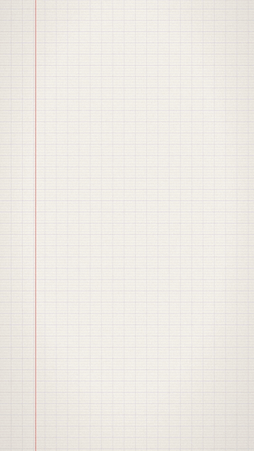

<h1 align="center">explainer-shorts</h1>

<p align="center"><b>写一段 Markdown，出一支竖屏讲解视频。</b><br>
画面、音效、配乐，每一帧、每一个音都由代码生成。<br>
Claude Code skill · <a href="README.md">English</a></p>

<p align="center">
  
  &nbsp;&nbsp;
  
</p>
<p align="center"><sub>完整演示：<a href="docs/demo/karpathy.zh.mp4">作业本（中文，60 秒）</a> · <a href="docs/demo/karpathy.en.mp4">夜色（英文，65 秒）</a>，脚本都在 <a href="skills/explainer-shorts/examples">examples/</a>。</sub></p>

> “我最看好的输出形式，是针对任意题目、完全定制的讲解视频。”
> —— [Andrej Karpathy，2026-10-02](https://x.com/karpathy/status/2105819303471976479)

这个 skill 做的就是这种视频：9:16 竖屏，直接发抖音、小红书、视频号、TikTok、Reels、Shorts。

- **你只写 30 行左右的 Markdown。** 排版、按阅读速度定节奏、镜头移动、手写效果、涂鸦、音效、响度、编码，都由引擎完成。
- **全部是代码。** 不用素材库，不用视频生成模型，也不用配音。笔划声、气泡音、铃声和配乐都由 Web Audio 按画面的同一条时间轴合成。
- **中文优先，英文也行。** 逐字书写；中文标点不会单独落在行首；中文字体在第一次运行时自动安装。
- **为讲事实而做。** 某一屏出现了数字却没有 `^ 来源` 行，检查时会提醒。
- **三套画面，也能自己做：** `notebook`（法国作业本、蓝墨水、红笔批注）、`night`（夜空、白色动态字、金色点缀）和 `chalk`（黑板粉笔）。新做一套画面只需要一个 CSS 文件。

## 安装

在 Claude Code 里：

```
/plugin marketplace add xiaoye-motdore/explainer-shorts
/plugin install explainer-shorts@explainer-shorts
```

不用插件系统的话，把 `skills/explainer-shorts/` 复制到 `~/.claude/skills/` 也可以。

**需要：** Node 20+、ffmpeg、Chrome 或 Chromium（都没有的话运行 `setup --browser`）。第一次运行会把字体和渲染器（约 120 MB）装到 `~/.cache/explainer-shorts`。

**状态：** v0.1，已在 Linux 上测试；macOS 和 Windows 应该可以用，但还没测过，欢迎提 issue。

## 用法

直接对 Claude 说：

> 做一支 45 秒的竖屏视频，讲清楚天为什么是蓝的。

Claude 会写脚本、跑检查、看一张抽帧预览图，再正式渲染。也可以自己跑命令：

```bash
node skills/explainer-shorts/scripts/es.mjs lint    my-topic.md   # 时长和提醒
node skills/explainer-shorts/scripts/es.mjs preview my-topic.md   # 12 帧预览图
node skills/explainer-shorts/scripts/es.mjs render  my-topic.md   # 成片 + 封面
```

## 脚本长这样

```markdown
---
title: Karpathy 最看好的，是哪一种？
theme: notebook
author: 你的名字
---

# AI 交给你的东西，
# 你怎么看得懂？
> Karpathy 排了四档，
> 一档比一档好。
^ @karpathy · 2026-10-02

## 第 4 档 · ？
~~更长的文章？~~
~~更好看的网页？~~
!! 讲解视频
```

| 写法 | 画面上 |
|---|---|
| `# 文字` | 开头钩子 / 大标题，逐字写出 |
| `## 文字` | 新的一屏，镜头移过去 |
| `文字` · `- 文字` | 普通一行 · 列表 |
| `> 文字` | 页边批注 |
| `~~文字~~` | 错误答案，写完被划掉 |
| `!! 文字` | 大揭晓；里面有数字会滚动计数 |
| `[标签] 文字` | 盖章标签 |
| `= 文字` | 公式，逐字打出 |
| `^ 文字` | 来源 |
| `...` | 停顿，配乐静音一拍 |
| ```` ```svg ```` | 涂鸦，一笔一笔画出来 |

完整写法见 [reference/format.md](skills/explainer-shorts/reference/format.md)。

## 画面主题

<p align="center"></p>

上图是同一个脚本分别用 `notebook`、`night`、`chalk` 和一个自定义的宣纸主题（[examples/themes/xuan.css](skills/explainer-shorts/examples/themes/xuan.css)）渲染出来的。

一个主题就是一个 CSS 文件：管颜色、字体、背景，再加几个引擎开关（手写还是逐字浮现、用哪套音效、配什么音乐）。想用自己的主题，在 front matter 里写 `theme: ./my-theme.css`。写法见 [reference/themes.md](skills/explainer-shorts/reference/themes.md)。

## 输出

| 文件 | |
|---|---|
| `名字.mp4` | H.264 1080×1920、30 fps、AAC 48 kHz，带配乐和音效；响度 −16 LUFS，真峰值 −1.5 dBTP |
| `名字.no-music.mp4` | 同样的画面，只有音效，方便在平台里配音乐 |
| `名字.cover-9x16.png`、`名字.cover-3x4.png` | 封面 |
| `名字.report.json` | 时长、帧数、渲染耗时、响度、提醒 |

**实测**（2 核云服务器，没有显卡）：

| 视频 | 帧数 | 渲染耗时 |
|---|---|---|
| 60 秒，作业本 | 1,811 | 168 秒 |
| 65 秒，夜色 | 1,959 | 118 秒 |

## 原理

```
script.md ─► 解析 ─► 按阅读速度排时间 ─┬─► 无头 Chromium：排版、测量、规划镜头
                                       │      └─► 每帧 renderAt(t) ─► JPEG ─► ffmpeg (H.264)
                                       └─► Web Audio 离线合成：同一组事件生成音效和配乐
                                              └─► 两遍响度标准化 ─► 合成
```

画面是确定的：`renderAt(t)` 只取决于时间，任何一帧都能单独渲染，所以预览只要几秒。

## 计划

- 配音：接 ElevenLabs 或本地 TTS，字幕跟着声音走
- 主题支持动态背景脚本（着色器、3D）
- 内置图表块（柱状、折线、计数器）

## 许可

MIT。字体为霞鹜文楷、Caveat、Noto Sans SC、Space Grotesk、IBM Plex Mono，均为 SIL Open Font License；首次运行时从 npm 安装，不打包在仓库里。
